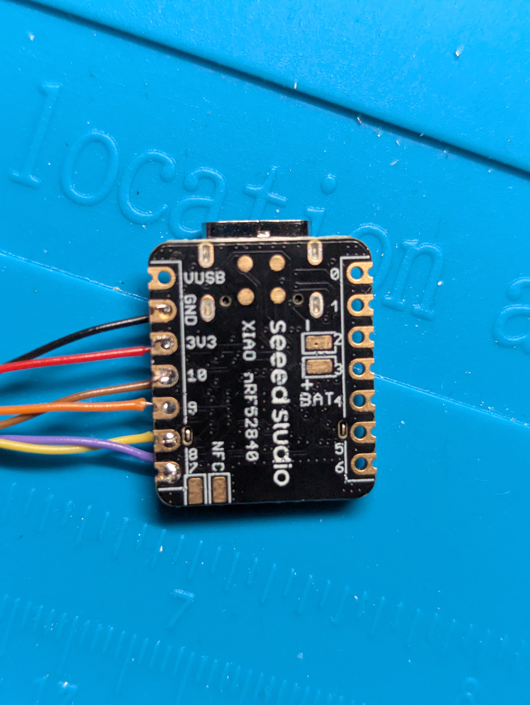
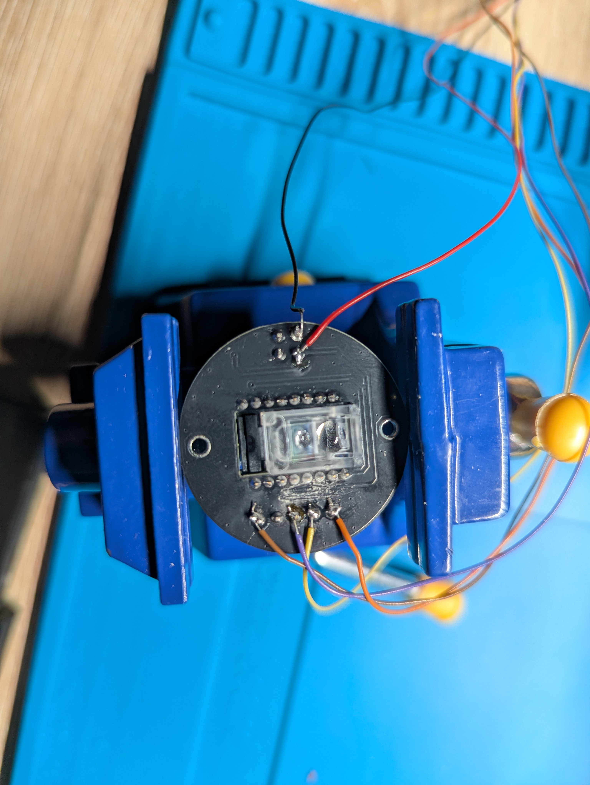

# zmk-config-adept
ZMK configuration for a trackball-only Ploopy Adept BLE

## Features

- Cursor acceleration
- Optimal report rate (125hz)
- RGB LED status indicator
- USB logging for debugging

## Hardware Connections

### PMW3610 Trackball Sensor to Xiao BLE

| PMW3610 Pin | Wire Color | Xiao BLE Pin | nRF52840 Pin | Description |
|-------------|------------|--------------|--------------|-------------|
| VDD | Red | 3V3 | - | Power (3.3V) |
| GND | Black | GND | - | Ground |
| SCLK (SCL) | Yellow | D8 | P1.13 | SPI Clock |
| SDIO | Orange | D9 | P1.14 | SPI Data (3-wire, shared MOSI/MISO) |
| NCS (CS) | Violet | D7 | P1.12 | Chip Select |
| MOT (IRQ) | Brown | D10 | P1.15 | Motion Interrupt |

**Note:** All connections are on the **right side** of the Xiao BLE board.

#### Wiring Photos

| Xiao BLE Connections | PMW3610 Module |
|----------------------|----------------|
|  *Xiao BLE with connections on the right side* |  *PMW3610 sensor mounted in trackball assembly* |
